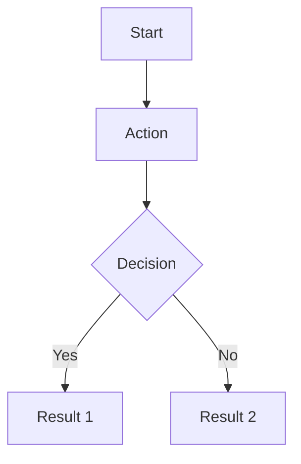

# Product Designer Documentation Rules

> Rules for **Product Designers** — responsible for Product Doc (Part 1: UX), wireframes, and design system audit.

## Related Rules
- **Naming Conventions**: [doc-naming-conventions.md](./doc-naming-conventions.md)
- **Workflow**: [doc-workflow-rules.md](./doc-workflow-rules.md)
- **PM/Lead**: [doc-pm-lead-rules.md](./doc-pm-lead-rules.md)
- **Engineer**: [doc-engineer-rules.md](./doc-engineer-rules.md)
- **QA Tester**: [doc-qa-tester-rules.md](./doc-qa-tester-rules.md)

---

## Rule 1: Product Document (Part 1 — UX)

### 1.1 Location
```
Docs/01-product/<feature>-<ticket>_product_<yymmdd>_v<major>.<month>.<day>.md
```

### 1.2 When to Create
- **AFTER** Master Doc is created and approved
- **BEFORE** Engineering Doc
- Reference: `.qwen/skills/product-design-doc/SKILL.md`

### 1.3 Required Sections (MANDATORY)
- [ ] **Persona** — Primary & Secondary users
- [ ] **Scenario** — Current state → Desired state → Business impact
- [ ] **Audit** — Problem/root cause analysis (high-level, not file-by-file)
- [ ] **Solution (Product & UX)** — Goals, scope, metrics; not repo file lists
- [ ] **User Flow** — **Mermaid diagram required** (`flowchart`, `sequenceDiagram`, or `journey`)
- [ ] **Wireframe** — Component layout, responsive breakpoints
- [ ] **Design System Audit** — Token compliance check (see Rule 2)
- [ ] **Changelog** — With HH:mm timestamps

---

## Rule 2: Design System Audit

### 2.1 Purpose
Verify that the feature uses existing design tokens and components before creating new ones.

### 2.2 Audit Format
```markdown
## Design System Audit
### Audit Date: YYYY-MM-DD HH:mm
### Status: ✅ Pass / ⚠️ Updates Needed

### Token Compliance Check
- **Primitive Tokens:** ✅ Present / ❌ Missing
- **Semantic Tokens:** ✅ Present / ❌ Missing
- **Component Tokens:** ✅ Present / ❌ Missing
- **Hardcoded Values Found:** <count> (list them)
  - `src/xxx.css`: `#2563EB` → Should use `var(--color-primary)`
  - ...

### Tokens Updated (if any)
- Token 1: <old> → <new>
- Token 2: ...

### Recommendations
- Recommendation 1
- Recommendation 2

### Approval
- **Auditor:** Product-Designer Agent
- **Approved By:** @user (if updates needed)
```

### 2.3 Rules
- Audit **MUST** be done BEFORE designing wireframes
- List **every** hardcoded value found with file path and suggested token
- If tokens need updating, get @user approval before changes
- If no hardcoded values found → status = ✅ Pass

---

## Rule 3: User Flow (Mermaid Required)

### 3.1 Format
```markdown
## User Flow



### 3.2 Rules
- Node IDs: **no spaces**
- Complex labels: follow Mermaid quoting rules
- **No HTML entities** in labels
- Must cover the **happy path** + at least **one edge case**

---

## Rule 4: Wireframe

### 4.1 Format
```markdown
## Wireframe
### Component layout
[ASCII diagram or description of layout structure]

### Responsive breakpoints
| Breakpoint | Layout | Notes |
|-----------|--------|-------|
| Mobile (< 768px) | ... | ... |
| Tablet (768px - 1024px) | ... | ... |
| Desktop (> 1024px) | ... | ... |
```

### 4.2 Rules
- Show component hierarchy (parent → children)
- Include **all three breakpoints**: mobile, tablet, desktop
- Note which existing components are reused vs. new

---

## Rule 5: Design Links (Two-Stage Process: Wireframe → Visual UI)

### 5.1 Stage 1: Wireframe (ChatGPT-5-4-Mini Extra-high)

**Model Requirement:** All wireframe operations MUST use `ChatGPT-5-4-Mini Extra-high` model

**Focus:** Structure, layout, component placement, spacing, hierarchy

```markdown
## Design Links

### Stage 1: Wireframe (ChatGPT-5-4-Mini Extra-high)
- **Wireframes:** [Open in Pencil via Codex CLI](<pencil-wireframe-url-or-path>)
  - Created: YYYY-MM-DD HH:mm
  - Model: ChatGPT-5-4-Mini Extra-high
  - File: `Docs/01-product/wireframes/<feature>/wireframe.pencil`
  - Design Name: `<feature-name>-<ticket-id>-wireframe`
  - **Focus:** Layout, structure, component hierarchy
  - **Library Used:** `Docs/01-product/design-system/<project>-library.pencil`
  - **Components Reused:** Button, Input, Card, Modal, Navbar...
  - **New Components Added:** <list or "None">
  - **Approval Status:** ⏸️ Pending / ✅ Approved / ❌ Needs Revision

### Creation Command (Wireframe)
```bash
codex run --model "chatgpt-5-4-mini-extra-high" \
  --prompt "Create Pencil wireframe layout: <layout-spec>"
```
```

### 5.2 Stage 2: Visual UI Design (ChatGPT-5-4-extra-high)

**Model Requirement:** All visual design operations MUST use `ChatGPT-5-4-extra-high` model

**Trigger:** ONLY after wireframe approved by user

**Focus:** Colors, typography, icons, visual hierarchy, shadows, gradients, polish

```markdown
### Stage 2: Visual UI Design (ChatGPT-5-4-extra-high)
- **Visual UI:** [Open in Pencil via Codex CLI](<pencil-visual-url-or-path>)
  - Created: YYYY-MM-DD HH:mm
  - Model: ChatGPT-5-4-extra-high
  - File: `Docs/01-product/mockups/<feature>/ui-mockup.pencil`
  - Design Name: `<feature-name>-<ticket-id>-visual`
  - **Based on Approved Wireframe:** `Docs/01-product/wireframes/<feature>/wireframe.pencil`
  - **Focus:** Colors, typography, icons, visual polish
  - **Design Tokens Used:** var(--color-primary), var(--spacing-md), etc.
  - **Status:** ⏳ Not started / ✅ Completed

### Creation Command (Visual UI)
```bash
codex run --model "chatgpt-5-4-extra-high" \
  --prompt "Design visual UI from approved wireframe: <visual-spec>"
```
```

### 5.2 Component Library Format
```markdown
## Component Library
### Library File
`Docs/01-product/design-system/<project>-library.pencil`

### Status
- **Created:** YYYY-MM-DD (first feature)
- **Last Updated:** YYYY-MM-DD
- **Total Components:** <count>

### Components Inventory
| Component | Category | States | Variants | First Used In |
|-----------|----------|--------|----------|---------------|
| Button | Forms | Default, Hover, Active, Disabled | Primary, Secondary, Danger | feature/1 |
| Input | Forms | Default, Focus, Error, Disabled | Text, Password, Search | feature/1 |
| Card | Layout | Default, Hover | Default, Elevated, Outlined | feature/1 |

### Reuse Tracking
| Feature | Components Reused | New Components Added |
|---------|-------------------|---------------------|
| feature/1 | N/A (first) | Button, Input, Card, Navbar |
| feature/2 | Button, Input, Card | Modal, Tabs |
```

---

## Rule 6: Product Doc → Engineer Handoff

### 6.1 What Engineer Needs From Product Doc
1. **Wireframe** → component structure and layout
2. **Responsive breakpoints** → CSS grid/flex configuration
3. **Component inventory** → what exists vs. what to create
4. **Design tokens** → CSS variables to use
5. **User flow** → navigation logic to implement

### 6.2 What Product Designer Needs From Engineer
- Confirmation that wireframes are technically feasible
- Any constraints (performance, bundle size, API limits)
- Updated Engineering Doc link in "Related Documents"

---

## Rule 7: Product Designer Checklist

### Before Starting Design
- [ ] Master Doc exists and is approved
- [ ] Branch name parsed correctly
- [ ] Design System Audit planned (check existing tokens/components)

### After Creating Product Doc
- [ ] All 6 required sections present (Persona, Scenario, Audit, Solution, User Flow, Wireframe)
- [ ] Mermaid diagram renders correctly
- [ ] Design System Audit completed
- [ ] Responsive breakpoints documented (mobile, tablet, desktop)
- [ ] "Related Documents" section includes links to Master Doc
- [ ] Changelog table with HH:mm timestamps
- [ ] Version number follows naming convention
- [ ] Sent to Product Lead for review

### After Review
- [ ] Addressed reviewer feedback
- [ ] Incremented version
- [ ] Updated changelog
- [ ] Got Product Lead sign-off
