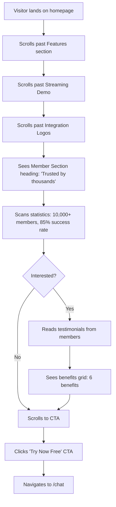

# Product Document: Add Member Content to Landing Page

## Metadata
- **Feature ID**: 4
- **Branch Name**: feature/4_them-noi-dung-thanh-vien
- **Master Doc**: `00-master/them-noi-dung-thanh-vien-4_master_260404_v1.0.0.md`
- **Created Date**: 2026-04-04 15:45
- **Last Updated**: 2026-04-04 18:10
- **Current Version**: v1.2.0
- **Author**: @dev
- **Status**: Draft
- **Reviewed By**: TBD

## Related Documents
- **Master Doc**: `00-master/them-noi-dung-thanh-vien-4_master_260404_v1.0.0.md` [link](../00-master/them-noi-dung-thanh-vien-4_master_260404_v1.0.0.md)
- **Engineering Doc**: `02-engineering/them-noi-dung-thanh-vien-4_engineering_260404_v1.0.0.md` (TBD)
- **QA Doc**: `03-qa/them-noi-dung-thanh-vien-4_qa_260404_v1.0.0.md` (TBD)
- **Tasks Doc**: `04-tasks/them-noi-dung-thanh-vien-4_tasks_260404_v1.0.0.md` [link](../04-tasks/them-noi-dung-thanh-vien-4_tasks_260404_v1.0.0.md)
- **GitHub Issue**: https://github.com/PersonalProjectJob/Job360/issues/4

---

## Persona

### Primary Users
- **Job Seekers (25-40 years old)**: Vietnamese professionals actively looking for jobs or career growth. They want social proof before investing time in a platform.
- **Career Changers**: People transitioning to a new industry who need guidance and reassurance that others have succeeded with Job360.

### Secondary Users
- **HR Recruiters**: Evaluating platform credibility and community size before recommending to candidates.
- **Tech Leads**: Considering whether to recommend Job360 to team members for career development.

---

## Scenario

### Current State
The landing page has:
- Hero section with AI chat preview
- Feature cards (6 features)
- Streaming demo
- Integration logos
- CTA section

**Missing**: No social proof, no member testimonials, no statistics showing platform effectiveness.

### Desired State
Add a "Member Section" between Integration Logos and CTA that:
- Shows key statistics (member count, success rate, placements)
- Displays member testimonials with photos and quotes
- Highlights membership benefits in a structured grid
- Builds trust and increases conversion to try the platform

### Business Impact
- Increase landing page → chat conversion rate by showcasing community size
- Reduce bounce rate by providing social proof early in the user journey
- Build credibility for first-time visitors unfamiliar with Job360

---

## Audit

### Problem / Root Cause
- **Problem**: Landing page lacks social proof — visitors cannot see if others have succeeded with the platform
- **Root cause**: No member-focused content section exists; current sections focus on features only, not outcomes
- **Gap**: Users need trust signals (testimonials, statistics) before committing to try

### Codebase Review (High Level)
- **Areas to create**: New component `MemberSection.tsx` in `src/app/components/landing/`
- **Areas to modify**: `LandingPage.tsx` (import and position new component), `vi.ts` and `en.ts` (add translations)
- **Existing patterns to follow**: `FeatureCards.tsx`, `IntegrationLogos.tsx`, `LandingCTA.tsx` — all use `motion/react` for animations, i18n for translations, responsive design

### Gaps Identified
1. No member statistics section on landing page
2. No testimonials carousel component exists
3. No benefits grid component exists
4. Translation keys for member content not defined

---

## Solution (Product & UX)

### Product Goals
- Build trust through social proof (member count, success stories)
- Increase conversion rate from landing page to chat
- Provide transparency about membership benefits
- Maintain design consistency with existing landing page

### UX Principles
- **Show, don't tell**: Use real numbers and real-sounding testimonials, not vague claims
- **Progressive disclosure**: Statistics first (quick scan), then testimonials (emotional connection), then benefits (rational decision)
- **Visual hierarchy**: Section label → heading → description → content → CTA
- **Performance first**: Animations must not cause layout shifts or jank

### In Scope
- Static data (member statistics, testimonials) — no API integration yet
- Bilingual support (Vietnamese + English)
- Responsive design (mobile 375px → desktop 1200px+)
- Scroll-driven entrance animations (fade-in, stagger)

### Out of Scope
- Backend API for real member data
- Real-time member count updates
- Video testimonials
- Member profile pages
- Authentication-gated content

---

## User Flow



---

## Wireframe

### Component Layout

```
┌─────────────────────────────────────────────────────────┐
│  Section Label: "Cộng đồng" (small, uppercase, primary) │
│                                                         │
│  Heading: "Được tin dùng bởi hàng nghìn người tìm việc" │
│  Description: "Tham gia cộng đồng professionals..."     │
│                                                         │
├─────────────────────────────────────────────────────────┤
│  STATISTICS ROW (4 columns desktop / 2x2 mobile)        │
│  ┌──────────┐ ┌──────────┐ ┌──────────┐ ┌──────────┐   │
│  │ 10,000+  │ │   85%    │ │  5,000+  │ │  4.8/5   │   │
│  │ Members  │ │ Success  │ │ Placed   │ │ Satisfied│   │
│  └──────────┘ └──────────┘ └──────────┘ └──────────┘   │
├─────────────────────────────────────────────────────────┤
│  TESTIMONIALS (heading + carousel)                      │
│  "Thành viên nói gì về chúng tôi"                       │
│                                                         │
│  ┌───────────────────────────────────────────────┐      │
│  │  [Avatar]  "Nhờ Job360, tôi đã nhận được..."  │      │
│  │            — Nguyễn Minh Anh, Frontend Dev    │      │
│  │            ◄  ●  ○  ○  ○  ►                  │      │
│  └───────────────────────────────────────────────┘      │
├─────────────────────────────────────────────────────────┤
│  BENEFITS GRID (heading + 6 cards, 3 cols / 1 col mob) │
│  "Lợi ích khi tham gia"                                 │
│                                                         │
│  ┌─────────────┐ ┌─────────────┐ ┌─────────────┐       │
│  │ 🎯 JD       │ │ 📄 CV       │ │ 💬 Interview│       │
│  │  Analysis   │ │  Review     │ │  Practice   │       │
│  └─────────────┘ └─────────────┘ └─────────────┘       │
│  ┌─────────────┐ ┌─────────────┐ ┌─────────────┐       │
│  │ 📈 Salary   │ │ 🗺️ Roadmap  │ │ 👥 Community│       │
│  │  Reference  │ │  Personalized│ │ Supportive │       │
│  └─────────────┘ └─────────────┘ └─────────────┘       │
└─────────────────────────────────────────────────────────┘
```

### Responsive Breakpoints

| Breakpoint | Layout | Notes |
|-----------|--------|-------|
| **Mobile** (< 768px) | 1 column, statistics 2x2 grid | Horizontal scrolling for testimonials |
| **Tablet** (768px - 1024px) | 2 columns for benefits | Testimonials carousel with dots |
| **Desktop** (> 1024px) | 3 columns for benefits, 4-column stats | Full horizontal testimonials |

### Design Tokens

All styling will use existing CSS variables:
- Colors: `var(--primary)`, `var(--secondary)`, `var(--background)`, `var(--muted)`, `var(--foreground)`, `var(--muted-foreground)`
- Spacing: `var(--spacing-xs)`, `var(--spacing-sm)`, `var(--spacing-md)`, `var(--spacing-lg)`, `var(--spacing-xl)`
- Typography: `var(--font-size-h2)`, `var(--font-size-body)`, `var(--font-size-small)`, `var(--font-weight-semibold)`
- Shadows: Neumorphic (`6px 6px 14px rgba(0,0,0,0.06), -4px -4px 12px rgba(255,255,255,0.8)`)
- Border radius: `var(--radius-card)`, `var(--radius)`

---

## Component Library

### Library Status
- **Library File:** `Docs/01-product/design-system/job360-library.pencil` — **NOT YET CREATED**
- **Reason:** This is the first feature with a formal design process; no prior .pencil files exist
- **Pencil MCP:** Not available in current environment (no Pencil extension installed)
- **Alternative:** Wireframes documented in markdown format (see Wireframe section above)

### Components Inventory (Existing React Components)
| Component | Category | Source File | First Used In |
|-----------|----------|-------------|---------------|
| HeroSection | Landing | `src/app/components/landing/HeroSection.tsx` | Feature 1 |
| FeatureCards | Landing | `src/app/components/landing/FeatureCards.tsx` | Feature 1 |
| StreamingDemo | Landing | `src/app/components/landing/StreamingDemo.tsx` | Feature 1 |
| IntegrationLogos | Landing | `src/app/components/landing/IntegrationLogos.tsx` | Feature 1 |
| LandingCTA | Landing | `src/app/components/landing/LandingCTA.tsx` | Feature 1 |
| LandingNav | Landing | `src/app/components/landing/LandingNav.tsx` | Feature 1 |
| LandingFooter | Landing | `src/app/components/landing/LandingFooter.tsx` | Feature 1 |
| AnimatedBackground | Landing | `src/app/components/landing/AnimatedBackground.tsx` | Feature 1 |
| ChatPreview | Landing | `src/app/components/landing/ChatPreview.tsx` | Feature 1 |
| Button | UI | `src/app/components/ui/button.tsx` | Feature 1 |

---

## Design System Audit

### Audit Date: 2026-04-04 16:15
### Status: ⚠️ Partial Pass — Tokens available, but codebase has hardcoded values in other files

### Token Architecture Analysis

The project uses a **flat token system** in `src/styles/theme.css`. It does NOT follow the recommended three-layer architecture (Primitive → Semantic → Component).

| Layer | Status | Details |
|-------|--------|---------|
| **Primitive Tokens** | ⚠️ Partial | Hex values defined directly in semantic tokens (no intermediate primitives like `--color-navy-900`) |
| **Semantic Tokens** | ✅ Present | `--primary`, `--secondary`, `--muted`, `--foreground`, `--background`, `--border`, `--ring`, etc. |
| **Component Tokens** | ❌ Missing | No component-specific tokens (`--button-bg`, `--card-bg`, `--card-shadow`, `--stat-card-bg`) |

### Token Compliance Check for Feature #4
- **Color tokens available:** ✅ `--primary`, `--secondary`, `--muted`, `--foreground`, `--muted-foreground`, `--background`, `--border`, `--color-success`, `--color-warning`
- **Spacing tokens available:** ✅ `--spacing-xs`, `--spacing-sm`, `--spacing-md`, `--spacing-lg`, `--spacing-xl`
- **Typography tokens available:** ✅ `--font-size-h1`, `--font-size-h2`, `--font-size-body`, `--font-size-small`, `--font-size-caption`, `--font-weight-semibold`
- **Border radius available:** ✅ `--radius`, `--radius-card`
- **Shadow tokens:** ⚠️ Only `--elevation-sm` exists; neumorphic shadows NOT tokenized (defined inline in FeatureCards.tsx)

### Neumorphic Pattern Reference (from FeatureCards.tsx)
The existing neumorphic shadow pattern used throughout landing page components:
- Outer: `12px 12px 30px rgba(0,0,0,0.08), -8px -8px 24px rgba(255,255,255,0.9)`
- Inner: `inset 4px 4px 12px rgba(0,0,0,0.05), inset -4px -4px 12px rgba(255,255,255,0.8)`
- Card: `6px 6px 16px rgba(0,0,0,0.06), -4px -4px 12px rgba(255,255,255,0.8)`

### Hardcoded Values Found in Codebase (Other Files — NOT in Feature #4 scope)

| File | Value | Issue | Suggested Token |
|------|-------|-------|-----------------|
| `theme.css` | `#22C55E` | Primitive in semantic | Add `--color-green-500` primitive |
| `theme.css` | `#F59E0B` | Primitive in semantic | Add `--color-amber-500` primitive |
| `theme.css` | `#0B2545` | Primitive in semantic | Add `--color-navy-900` primitive |
| `theme.css` | `#4AADE6` | Primitive in semantic | Add `--color-sky-400` primitive |
| `theme.css` | `#F8FAFC` | Primitive in semantic | Add `--color-slate-50` primitive |
| `theme.css` | `#F1F5F9` | Primitive in semantic | Add `--color-slate-100` primitive |
| `theme.css` | `#fff` | Raw white | `var(--background)` |
| `JobsPage.tsx` | `#facc15`, `#f59e0b`, `#d97706` | Amber/yellow not tokenized | Add `--color-amber-*` primitives |
| `chart.tsx` | `#ccc` | Hardcoded gray | Should use `var(--border)` |
| `theme.css` | `24px` (h3) | Raw px font-size | `var(--font-size-h2)` or new token |

### Feature #4 Specific: Hardcoded Values = 0 (will use CSS variables throughout)

### Components to Reuse
| Component | Source File | Status |
|-----------|-------------|--------|
| Button | `src/app/components/ui/button.tsx` | Reuse as-is |
| cn utility | `src/app/components/ui/utils.ts` | Reuse as-is |
| motion/react animations | `motion/react` (library) | Reuse patterns from FeatureCards |
| Neumorphic shadow pattern | `FeatureCards.tsx` | Reuse shadow values |

### New Components to Create
| Component | Purpose | Variants |
|-----------|---------|----------|
| `MemberSection` | Landing page member content container | None |
| `StatCard` | Display single statistic with animated counter | Default only |
| `TestimonialCard` | Member testimonial quote with avatar | Default only |
| `BenefitCard` | Benefit with icon + description | Default, hover (neumorphic) |

### Component Library Status
- **Library File:** `Docs/01-product/design-system/` — **DOES NOT EXIST** (first feature requiring design system)
- **Action:** This audit serves as the foundation for future component library creation
- **No .pencil files exist** in the project — Pencil MCP has not been used yet

### Recommendations
1. **For Feature #4:** All new components MUST use CSS variables (`var(--primary)`, `var(--muted)`, etc.) — NO hardcoded hex values
2. **Neumorphic shadows:** Reuse exact shadow values from `FeatureCards.tsx` for consistency; consider tokenizing as `--shadow-neumorphic-outer` and `--shadow-neumorphic-inner` in a future token update
3. **Future:** Migrate `theme.css` to three-layer token architecture (Primitive → Semantic → Component) for better theme switching support
4. **Future:** Tokenize amber/yellow color scale for warning states (currently hardcoded in `JobsPage.tsx`)

### Approval
- **Auditor:** Product-Designer Agent
- **Approved By:** Awaiting user confirmation (no token changes needed for Feature #4 — existing tokens sufficient)
- **Decision:** Proceed with design using existing CSS variables

---

## Design Links

### Pencil MCP
- **Status:** Attempted on 2026-04-04 18:10 but unavailable in this session
- **Observed Result:** Pencil MCP tool calls returned `user cancelled MCP tool call`
- **Alternative:** Fallback wireframe package created in repo for implementation handoff
- **Wireframes Directory:** `Docs/01-product/wireframes/feature-4-them-noi-dung-thanh-vien/`
- **Mockups Directory:** `Docs/01-product/mockups/`

### Design Artifacts
- **Wireframes:**
  - `Docs/01-product/wireframes/feature-4-them-noi-dung-thanh-vien/member-section-wireframe.svg`
  - `Docs/01-product/wireframes/feature-4-them-noi-dung-thanh-vien/member-section-wireframe-spec.md`
- **Neumorphic Shadow Specs:**
  - Outer: `12px 12px 30px rgba(0,0,0,0.08), -8px -8px 24px rgba(255,255,255,0.9)`
  - Inner: `inset 4px 4px 12px rgba(0,0,0,0.05), inset -4px -4px 12px rgba(255,255,255,0.8)`
  - Card: `6px 6px 16px rgba(0,0,0,0.06), -4px -4px 12px rgba(255,255,255,0.8)`
- **Color Palette:** `--primary: #0B2545` (Navy), `--secondary: #4AADE6` (Sky Blue), `--muted: #F8FAFC` (Slate)

---

## Changelog

| Version | Date | Time (HH:mm) | Author | Description | Reviewed By | Status |
|---------|------|--------------|--------|-------------|-------------|--------|
| v1.0.0 | 2026-04-04 | 15:45 | @dev | Initial product doc with wireframes, user flow, design audit | TBD | Draft |
| v1.1.0 | 2026-04-04 | 16:15 | Product-Designer Agent | Added Design System Audit (detailed), Component Library status, Design Links, updated changelog | TBD | Review |
| v1.2.0 | 2026-04-04 | 18:10 | Product-Designer Agent | Added repo wireframe fallback package (`.svg` + spec), documented Pencil MCP blocker for this session | TBD | Review |
